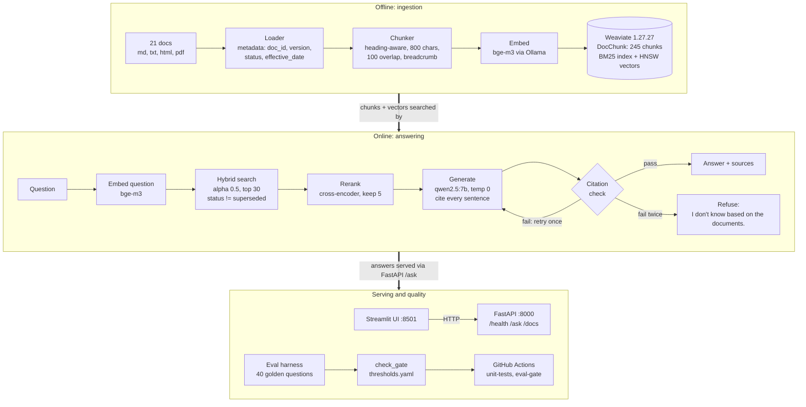
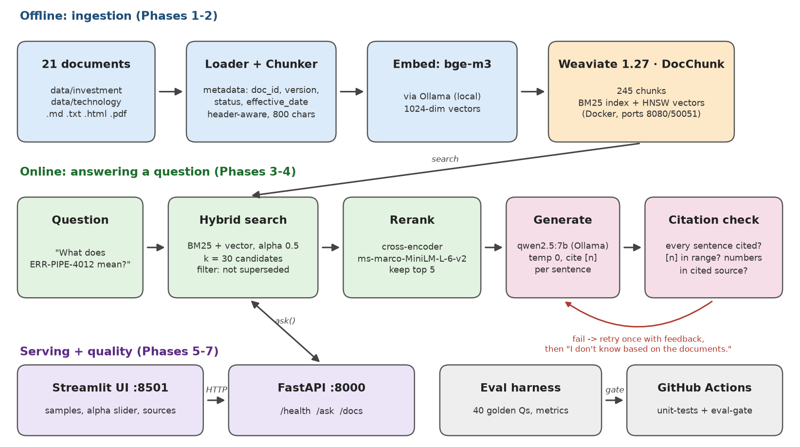

# Production-Grade RAG: Ask My Docs

**Ask questions about your company's documents and get short answers where every sentence cites its source, and an honest "I don't know" when the documents don't say. It runs 100% locally on a CPU laptop and a CI gate blocks quality regressions.**

[](https://github.com/<OWNER>/<REPO>/actions/workflows/rag-ci.yml)


> Replace `<OWNER>/<REPO>` in the first badge with your GitHub user and repository name (for example `suhail/ask-my-docs`). The other badges are static.


*The question "What does ERR-PIPE-4012 mean?" answered with citations [1][2], with source [1] opened to show the exact runbook chunk. A full-quality recording is in [docs/demo_ask_question.mp4](docs/demo_ask_question.mp4), and there's an 11-page illustrated walkthrough in [docs/RAG_Walkthrough.pdf](docs/RAG_Walkthrough.pdf).*

> **The corpus is fictional.** The 21 documents describe an invented asset manager (Halvorsen Ridge Capital Management, "HRCM") and its data platform. They include policies, risk frameworks, fund factsheets, runbooks, ADRs and security standards. They were written to test real RAG problems such as version conflicts, exact error codes, tables, PDFs and questions the documents can't answer. No real company data is included.

---

## Contents
- [What it does](#what-it-does)
- [Architecture](#architecture)
- [Request lifecycle](#request-lifecycle-step-by-step)
- [Tech stack](#tech-stack-and-why)
- [Repository structure](#repository-structure)
- [Quickstart](#quickstart)
- [Running each phase](#running-each-phase)
- [Evaluation and results](#evaluation-and-results)
- [CI: the quality gate](#ci-the-quality-gate)
- [Design decisions and trade-offs](#design-decisions-and-trade-offs)
- [Known limitations](#known-limitations)
- [Roadmap](#roadmap)
- [Interview talking points](#interview-talking-points)
- [Glossary](#glossary-plain-english)
- [Author](#author)

---

## What it does

| You ask | The system |
|---|---|
| *"What does ERR-PIPE-4012 mean?"* | Finds the exact error code with keyword search and answers "Schema drift detected in Bronze ingestion [1][2]". |
| *"What is the current equity VaR limit?"* | Answers **2.0% of NAV** from Risk Management Framework v2.0. The superseded v1.0 (2.5%) is filtered out before the LLM ever sees it. |
| *"How much can we lose before we have to cut risk?"* | Shares no keywords with the policy, but vector search still finds the stress-testing and risk-objective sections. |
| *"Could a company earning 15% of revenue from thermal coal be held in the Global Equity Fund? And the Sustainable Infrastructure Fund?"* | A multi-document question: it needs the ESG stewardship policy plus the Sustainable Infrastructure Fund factsheet. This is the hardest question type (see [limitations](#known-limitations)). |
| *"What is the expense ratio of the Halvorsen Ridge Emerging Markets Fund?"* (the fund doesn't exist) | Answers **"I don't know based on the documents."** and doesn't make one up. |

What makes it "production-grade" rather than a notebook demo:

- **Grounded answers enforced in code.** A plain-Python citation checker rejects any answer with an uncited sentence, a source number that doesn't exist, or a number that isn't in the cited source. The model gets one retry with the errors as feedback. If it fails again, the system refuses.
- **Version awareness.** Every chunk carries `version`, `status` and `effective_date`, and superseded documents are excluded at query time.
- **Hybrid retrieval plus reranking.** Keyword search and vector search are combined, then a cross-encoder reranker re-scores the candidates. The alpha weighting was chosen with a measured sweep.
- **Measured quality.** A 40-question golden set covers 5 question types, with retrieval and generation metrics and an optional Ragas faithfulness score from a local judge.
- **CI eval gate.** Every pull request re-indexes the corpus and fails if retrieval quality drops below thresholds.
- **Served properly.** FastAPI (with health checks, validation and warm startup) sits in front of a Streamlit portal.
- **Private and free.** Everything runs locally (Ollama + Docker), with no API keys and no data leaving the machine.

---

## Architecture



If Mermaid doesn't render where you're reading this, here is the same picture as a PNG:



---

## Request lifecycle (step by step)

What happens when you click **Ask** in the portal:

1. **Streamlit → FastAPI.** The page sends `POST /ask {"question": "...", "alpha": 0.5}`. Pydantic validates it: the question must be 3–500 characters after trimming and alpha must be between 0 and 1. Anything else gets a `422` response.
2. **Shared pipeline.** The endpoint uses the one pipeline built at startup, which holds the open Weaviate connection, a warmed reranker, embedder and LLM client. It runs in FastAPI's thread pool so a slow answer doesn't block the server. A lock lets one question at a time use the CPU-bound LLM.
3. **Embed the question.** bge-m3, via Ollama, turns the question into a 1,024-number vector. It's the same model that embedded the chunks, so the vectors are comparable.
4. **Hybrid search.** Weaviate runs BM25 keyword search and vector search together, blends the scores with `alpha = 0.5` and returns the **top 30** chunks, skipping any chunk whose `status` is `superseded`. This takes about 0.2 s.
5. **Rerank.** The cross-encoder reads *(question, chunk)* pairs together, re-scores the 30 candidates and keeps the **best 5**. This takes about 0.5 s with MiniLM on CPU.
6. **Build the prompt.** The 5 chunks are numbered `[1]..[5]`, each with its `doc_id` and section heading. The rules are to use only these sources, cite `[n]` after every sentence, and reply exactly `I don't know based on the documents.` if the sources don't answer the question.
7. **Generate.** qwen2.5:7b runs with `temperature=0` (repeatable) and `num_ctx=8192` (so the prompt is never silently cut). This takes 2–15 s on an 8-core box and 40–150 s on a CPU laptop.
8. **Check citations (no AI).** The answer is split into sentences. Each must have at least one `[n]` with `n` between 1 and 5, and any number in a sentence (2.0%, 4012, 30) must appear in a cited chunk.
9. **Retry or refuse.** On failure the model gets one more attempt, with the exact errors as feedback ("Number(s) 15 not found in cited source [1] (they appear in [2])"). If it fails again, the answer becomes the refusal string. A wrong answer is worse than no answer.
10. **Respond.** The response contains the answer text, `refused`, `attempts`, the cited sources (`n`, `chunk_id`, `doc_id`, `section`, `source_file`, a text snippet), per-stage timings and any check errors. Streamlit shows the citations in bold, one expandable box per source, and a blue info box for refusals.

---

## Tech stack (and why)

| Layer | Choice | Why this one |
|---|---|---|
| Language and tooling | **Python 3.12**, **uv** | uv installs and locks dependencies 10–100x faster than pip, with a reproducible `uv.lock`. A CPU-only PyTorch index avoids pulling ~3 GB of CUDA wheels on CI. |
| Vector database | **Weaviate 1.27.27** (Docker) | Native **hybrid search** (BM25 + vectors) in one query, metadata filters, per-property tokenization and a good Python client. Pinned to a patch release (see [limitations](#known-limitations)). |
| Embeddings | **bge-m3** via **Ollama** | A strong open multilingual embedding model with 1,024 dimensions. Ollama serves it locally on CPU with no key and no cost. |
| Reranker | **cross-encoder/ms-marco-MiniLM-L-6-v2** (default for CPU) or **BAAI/bge-reranker-v2-m3** | MiniLM is small (~90 MB) and fast enough on a laptop CPU. bge-reranker-v2-m3 is more accurate (and multilingual) but several times slower on CPU, so it's the code default only for machines that can afford it. Switch with `RERANK_MODEL`. |
| LLM | **qwen2.5:7b** via Ollama | Good instruction following and citation discipline at a size a 16 GB CPU laptop can run (~4.7 GB download). Swap it with `CHAT_MODEL`. |
| Orchestration helpers | **LangChain** text splitters + `langchain-ollama` | Splitters that know Markdown headings, and a thin chat/embeddings client. The pipeline logic itself is plain Python, with no framework magic in the critical path. |
| Evaluation | Custom metrics + **Ragas** (faithfulness) | Retrieval metrics are deterministic and fast. Ragas adds an LLM-as-judge faithfulness score using a local Ollama judge. |
| API | **FastAPI** + **uvicorn** | Typed request/response models (Pydantic), automatic `/docs`, lifespan hooks for loading models once, and a thread pool for blocking calls. |
| UI | **Streamlit** | A usable demo portal in ~130 lines of Python. It's a thin client that only calls the API. |
| CI | **GitHub Actions** | Free for public repos, can start Weaviate as a service container, caches models, and supports required status checks that block merges. |
| Tests | **pytest** | 41 fast tests (chunker, citations, metrics, gate, reranker, API with a fake pipeline). None of them need Weaviate or Ollama. |

---

## Repository structure

```text
.
├── README.md                     ← this file
├── README_CI.md                  ← CI details: jobs, caching, branch protection
├── pyproject.toml / uv.lock      ← dependencies (uv), incl. CPU-only torch index
├── docker-compose.yml            ← Weaviate 1.27.27 on ports 8080 (HTTP) and 50051 (gRPC)
├── .env.example                  ← every setting the code reads, with defaults
├── .github/workflows/rag-ci.yml  ← unit-tests → eval-gate on every PR; nightly full-eval
├── data/
│   ├── investment/               ← 11 fictional finance docs (policies, RMF v1 + v2, factsheets, fees, ESG…)
│   └── technology/               ← 10 fictional tech docs (runbook, ADRs incl. a PDF, API reference, SLAs…)
├── eval/
│   ├── golden_qa.jsonl           ← 40 questions with expected answers, source docs and question type
│   └── thresholds.yaml           ← minimum/maximum values the quality gate enforces
├── src/
│   ├── ingest/
│   │   ├── loaders.py            ← reads .md/.txt/.html/.pdf into text + metadata (doc_id, version, status, date)
│   │   ├── chunker.py            ← heading-aware splitting, breadcrumbs, keeps tables intact
│   │   └── indexer.py            ← embeds chunks with bge-m3 and upserts them into Weaviate (UUID5 ids)
│   ├── retrieval/
│   │   ├── retriever.py          ← hybrid search with the "not superseded" filter
│   │   ├── search_demo.py        ← CLI: show hybrid search results for a question
│   │   └── compare_demo.py       ← CLI: top 5 before vs after reranking
│   ├── rerank/
│   │   └── reranker.py           ← cross-encoder reranking (model loaded once, cached)
│   ├── generate/
│   │   ├── prompt.py             ← numbered sources + strict citation/refusal rules
│   │   ├── citations.py          ← pure-Python citation checker (sentences, [n], numbers)
│   │   └── answer.py             ← retrieve → rerank → generate → check → retry/refuse; CLI
│   ├── eval/
│   │   ├── metrics.py            ← hit@k, recall@k, MRR, section hit, refusal and number metrics
│   │   ├── run_eval.py           ← runs the golden set, writes reports/, resumable, many filters
│   │   ├── ragas_judge.py        ← optional Ragas faithfulness with a local Ollama judge
│   │   ├── sweep_alpha.py        ← retrieval-only runs across alpha values
│   │   ├── check_gate.py         ← compares a report with thresholds; exit 1 = fail
│   │   └── summary_md.py         ← Markdown PASS/FAIL table for the CI job summary
│   └── api/
│       └── app.py                ← FastAPI: lifespan warm-up, /health, /ask, validation, 503s
├── ui/
│   └── streamlit_app.py          ← demo portal: samples, alpha slider, cited answers, sources, history
├── scripts/
│   ├── ci_eval_gate.sh           ← the CI eval-gate steps, runnable locally
│   └── demo_screenshots.py       ← Playwright: screenshots + screen recording of the portal
├── tests/                        ← 41 tests, no services needed
│   ├── test_chunker.py   test_citations.py   test_metrics.py
│   └── test_gate.py      test_reranker.py    test_api.py
└── docs/                         ← walkthrough PDF/DOCX, demo video + GIF, screenshots, architecture.png
```

---

## Quickstart

### Prerequisites
- Python 3.12 and [uv](https://docs.astral.sh/uv/)
- Docker Desktop (Windows/mac) or Docker Engine (Linux)
- [Ollama](https://ollama.com/download)
- About 8 GB of free disk for the models (bge-m3 ~1.2 GB, qwen2.5:7b ~4.7 GB, reranker ~90 MB) and 16 GB of RAM recommended

### Windows (PowerShell)
```powershell
git clone https://github.com/<OWNER>/<REPO>.git; cd <REPO>
uv sync                                            # create .venv from uv.lock
Copy-Item .env.example .env                        # then edit if needed
docker compose up -d                               # Weaviate on :8080 / :50051
ollama pull bge-m3
ollama pull qwen2.5:7b
uv run pytest -v                                   # 41 tests, no services needed
uv run python -m src.ingest.indexer --recreate     # embed + index the 21 docs (~3 min on a laptop)
uv run python -m src.generate.answer "What does ERR-PIPE-4012 mean?"
```
Run the portal in **two terminals**:
```powershell
# Terminal 1: API (wait for "Pipeline ready, warm-up took …s")
uv run uvicorn src.api.app:app                     # http://localhost:8000/docs
# Terminal 2: UI
uv run streamlit run ui/streamlit_app.py           # opens http://localhost:8501
```
Windows tips:
- Use `curl.exe`, not `curl`, in PowerShell (`curl` is an alias for `Invoke-WebRequest`), for example `curl.exe http://localhost:8000/health`.
- `--reload` restarts the API (and its warm-up) on every file save, so use it only while editing code.
- If you set variables with `$env:NAME="..."` instead of `.env`, they only apply in that terminal.

### Linux / macOS
```bash
git clone https://github.com/<OWNER>/<REPO>.git && cd <REPO>
uv sync
cp .env.example .env
docker compose up -d
ollama pull bge-m3 && ollama pull qwen2.5:7b
uv run pytest -v
uv run python -m src.ingest.indexer --recreate
uv run uvicorn src.api.app:app &                   # or use a second terminal
uv run streamlit run ui/streamlit_app.py
```

### Configuration (`.env.example`)
```dotenv
OLLAMA_BASE_URL=http://localhost:11434
EMBED_MODEL=bge-m3
CHAT_MODEL=qwen2.5:7b
RERANK_MODEL=cross-encoder/ms-marco-MiniLM-L-6-v2   # code default is BAAI/bge-reranker-v2-m3 (slow on CPU)
JUDGE_MODEL=qwen2.5:7b                              # Ragas judge; defaults to CHAT_MODEL
# CORS_ORIGINS=http://localhost:3000                # only if a separate web frontend calls the API
# API_URL=http://localhost:8000                     # read by Streamlit from the SHELL environment, not .env
```

---

## Running each phase

The project was built in 7 phases. Each one is runnable on its own (from the repo root):

| Phase | What it adds | Command(s) |
|---|---|---|
| 1. Load and chunk | Loaders for 4 formats, metadata, heading-aware chunks with breadcrumbs | `uv run pytest tests/test_chunker.py -v` |
| 2. Embed and index | Weaviate collection with tuned tokenization, bge-m3 vectors, idempotent upserts | `docker compose up -d` · `uv run python -m src.ingest.indexer --recreate` |
| 3. Retrieve and rerank | Hybrid search, superseded filter, cross-encoder rerank | `uv run python -m src.retrieval.search_demo "your question"` · `uv run python -m src.retrieval.compare_demo` |
| 4. Generate with citations | Prompt, citation checker, retry/refuse loop | `uv run python -m src.generate.answer "What is the current equity VaR limit?"` |
| 5. Evaluation harness | Golden set metrics, Ragas, alpha sweep, thresholds + gate | see [Evaluation](#evaluation-and-results) |
| 6. CI eval gate | GitHub Actions: unit tests + retrieval gate, nightly generation subset | `bash scripts/ci_eval_gate.sh` (same steps locally) |
| 7. Demo portal | FastAPI + Streamlit | `uv run uvicorn src.api.app:app` · `uv run streamlit run ui/streamlit_app.py` |

API examples:
```bash
curl http://localhost:8000/health
# {"status":"ok","weaviate":true,"ollama":true,"missing_models":[],
#  "models":{"embed":"bge-m3","rerank":"cross-encoder/ms-marco-MiniLM-L-6-v2","chat":"qwen2.5:7b"}}

curl -X POST http://localhost:8000/ask -H "Content-Type: application/json" \
     -d '{"question": "What is the expense ratio of the Halvorsen Ridge Emerging Markets Fund?"}'
# {"answer":"I don't know based on the documents.","refused":true,"attempts":1,"sources":[], ...}
```

---

## Evaluation and results

```bash
uv run python -m src.eval.run_eval --retrieval-only        # retrieval metrics only, no LLM (~30 s)
uv run python -m src.eval.sweep_alpha                      # retrieval-only at alpha 0, .25, .5, .75, 1
uv run python -m src.eval.run_eval                         # full: answers all 40 questions
uv run python -m src.eval.run_eval --types unanswerable    # filters: --types, --ids q001,q005, --limit N
uv run python -m src.eval.run_eval --ragas --limit 5       # + Ragas faithfulness (slow)
uv run python -m src.eval.run_eval --resume                # continue an interrupted run
uv run python -m src.eval.check_gate                       # exit 1 if any threshold fails
uv run python -m src.eval.check_gate --only retrieval      # just the retrieval metrics (what CI gates on)
```

**Golden set:** 40 questions: 14 `exact_lookup`, 9 `semantic` (paraphrased), 7 `multi_doc`, 5 `conflict_version` (old vs new document versions) and 5 `unanswerable` (traps). Every result below comes from real runs with alpha 0.5, the MiniLM reranker, qwen2.5:7b and bge-m3 on an 8-core Linux box.

### Retrieval-only, by question type (40 questions, 27.9 s total)
| Type | n | hit@5 | recall@5 | recall@30 | section hit@5 | MRR (hybrid) | MRR (reranked) |
|---|---:|---:|---:|---:|---:|---:|---:|
| conflict_version | 5 | 1.000 | 0.900 | 0.900 | 1.000 | 1.000 | 0.900 |
| exact_lookup | 14 | 1.000 | 0.964 | 1.000 | 1.000 | 0.911 | 0.911 |
| multi_doc | 7 | 1.000 | 0.857 | 1.000 | 1.000 | 0.738 | 0.810 |
| semantic | 9 | 1.000 | 1.000 | 1.000 | 1.000 | 0.833 | 0.944 |
| unanswerable | 5 | – | – | – | – | – | – |
| **ALL (answerable)** | 35 | 1.000 | 0.943 | 0.986 | 1.000 | 0.869 | 0.898 |

Reranking lifts overall MRR from **0.869 to 0.898**, with the biggest gains on semantic questions (0.833 → 0.944) and multi-doc questions (0.738 → 0.810). Unanswerable questions have no expected source, so their retrieval metrics are blank.

### Alpha sweep (retrieval-only, 35 answerable questions)
| alpha | hit@5 | section hit@5 | recall@30 | MRR (hybrid) | MRR (reranked) | exact_lookup MRR (hybrid) | semantic MRR (hybrid) |
|---:|---:|---:|---:|---:|---:|---:|---:|
| 0.0 (BM25 only) | 0.971 | 0.971 | 0.986 | 0.681 | 0.869 | 0.748 | 0.534 |
| 0.25 | 1.000 | 1.000 | 0.986 | 0.743 | 0.898 | 0.780 | 0.647 |
| **0.5 (chosen)** | 1.000 | 1.000 | 0.986 | 0.869 | 0.898 | 0.911 | 0.833 |
| 0.75 | 1.000 | 1.000 | 0.986 | 0.893 | 0.898 | 0.917 | 0.944 |
| 1.0 (vectors only) | 1.000 | 1.000 | 0.986 | 0.898 | 0.898 | 0.881 | 0.944 |

Reading it: pure keyword search misses one question entirely. Pure vector search ranks exact-ID questions lower (0.881 vs 0.911–0.917). After reranking, every alpha from 0.25 to 1.0 gives the same final quality. **0.5** was kept as a balanced default because it is near the top for both exact IDs and paraphrases. 0.75 would be a defensible alternative on this corpus.

### Full end-to-end run (40 questions, qwen2.5:7b, 580 s on the box)
| Type | n | citation valid | unanswerable refused | wrong refusal | cited correct doc | number recall | avg s |
|---|---:|---:|---:|---:|---:|---:|---:|
| conflict_version | 5 | 1.000 | – | 0.000 | 1.000 | 0.504 | 16.0 |
| exact_lookup | 14 | 1.000 | – | 0.000 | 1.000 | 0.833 | 14.7 |
| multi_doc | 7 | 0.857 | – | 0.429 | 1.000 | 0.286 | 15.6 |
| semantic | 9 | 1.000 | – | 0.222 | 1.000 | 0.556 | 15.2 |
| unanswerable | 5 | 1.000 | 1.000 | – | – | – | 9.5 |
| **ALL** | 40 | **0.975** | **1.000** | **0.143** | **1.000** | 0.605 | 14.5 |

- **All 5 trap questions were refused**, and every answered question cites an expected document.
- 4 of 40 answers failed the citation check on the first attempt (three had an uncited sentence, one cited a number to the wrong source). **3 were fixed by the feedback retry**, and 1 became a refusal.
- **Wrong refusals: 5 of 35** (3 multi-doc, 2 semantic). This is the main weakness and the deliberate cost of strict grounding (see [limitations](#known-limitations)).
- **Ragas faithfulness: 1.00** on a 5-question subset (local qwen2.5:7b judge). The run took 336 s, about 50 s of judging per question.
- *Number recall* is a cheap overlap check against the expected answer, so treat it as a trend signal, not a correctness score.

### Quality gate output
```text
Gate check: reports/full_run.json (mode=full, 40 questions)
  PASS hit_at_5                   1.0     (min 0.95)
  PASS recall_at_5                0.943   (min 0.88)
  PASS recall_at_30               0.986   (min 0.95)
  PASS section_hit_at_5           1.0     (min 0.94)
  PASS mrr                        0.898   (min 0.82)
  PASS citation_valid             0.975   (min 0.92)
  PASS unanswerable_refusal_acc   1.0     (min 1.0)
  PASS wrong_refusal_rate         0.143   (max 0.2)
  PASS cited_correct_doc          1.0     (min 0.95)
  PASS number_recall              0.605   (min 0.5)
  SKIP faithfulness               -       (min 0.8)

GATE PASSED
```
Thresholds were set from these measured numbers with a small margin. With 35 answerable questions, one question is worth about 0.03. Metrics missing from a report (such as faithfulness without `--ragas`) are skipped unless `--strict` is passed.

### Timings
| Step | 8-core Linux box | CPU laptop (Windows) |
|---|---:|---:|
| Index 245 chunks (bge-m3) | ~60 s | ~173 s |
| Retrieve + rerank, per question | ~0.7 s | ~2 s (estimate) |
| Generate, per question | 2–15 s | 40–150 s |
| Full 40-question eval | 580 s | roughly 30–90 min, estimate (use `--resume`) |
| API warm-up at startup | 17 s | ~30–60 s (estimate) |

---

## CI: the quality gate

`.github/workflows/rag-ci.yml` runs on every pull request, on pushes to `main`, nightly, and on demand:

| Job | When | What it does | Typical time |
|---|---|---|---|
| `unit-tests` | every PR / push | `uv sync`, then `pytest` (no Weaviate/Ollama; caches the MiniLM model) | 2–3 min |
| `eval-gate` | after `unit-tests` | Starts Weaviate as a **service container**, installs Ollama, restores the cached `bge-m3`, indexes `data/`, runs `run_eval --retrieval-only`, `check_gate --only retrieval`, writes a PASS/FAIL table to the job summary and uploads `reports/` as an **artifact** | 6–10 min |
| `full-eval` | nightly at 03:00 IST + manual "Run workflow" | Same, plus the LLM on a small subset (unanswerable + conflict_version), gating retrieval, refusal and citation metrics | 15–30 min |

**Why PRs only gate retrieval:** answering 40 questions with a 7B model on a 4-vCPU runner takes 40+ minutes. Retrieval regressions (a chunking or alpha change that loses the right section) are the most common breakages and are caught in minutes. Generation is checked nightly.

**Make the gate block merges:**
1. Push the workflow and let it run once, because GitHub only lists check names it has already seen.
2. Go to **Settings → Rules → Rulesets → New branch ruleset** (or **Settings → Branches → Add rule**), with target `main`.
3. Enable **Require a pull request before merging** and **Require status checks to pass**, then add `unit-tests` and `eval-gate`. Don't add `full-eval`, because it never runs on PRs.

**Private repository notes:**
- Public repos get free Actions minutes. Private repos use the account's monthly quota, so the nightly `full-eval` is the job to watch, and you can disable its schedule.
- The status badge of a private repo is only visible to people with access.
- Enforced branch protection/rulesets on private repos need a paid plan (Pro/Team) on personal accounts. Check GitHub's current plan docs.

More detail is in `README_CI.md`.

---

## Design decisions and trade-offs

| Decision | Why | Trade-off |
|---|---|---|
| **Hybrid search, alpha 0.5** | Error codes and fund codes need exact keyword match, while paraphrases need vectors. The sweep shows each method alone loses something. | One more knob to tune per corpus. |
| **Retrieve 30, rerank to 5** | The cross-encoder is accurate but slow, so it only runs on a short list. The LLM sees 5 focused chunks, not 30 noisy ones. | ~0.5 s extra latency. A source that falls outside the top 30 can't be recovered (recall@30 is 0.986). |
| **Filter superseded docs at retrieval** | The LLM never sees stale limits, which is the most reliable way to avoid answering with old policy. | Historical questions depend on the current docs mentioning old values. |
| **Citation checking in code, not by another LLM** | Deterministic, instant, explainable and testable. It catches the most common grounding failures. | It checks format and numbers, not meaning (see limitations). |
| **One retry with feedback, then refuse (fail-closed)** | A wrong VaR limit is worse than "I don't know". | 14% wrong refusals on answerable questions. |
| **Heading-aware chunks with breadcrumbs (800 chars, 100 overlap)** | Each chunk is one coherent section, and the breadcrumb ("Runbook > 3. ERR-PIPE-4012…") gives both BM25 and the LLM context. Tables are never split. | Tuned for well-structured docs. Messy PDFs lose headings. |
| **Per-property tokenization** | IDs like `TECH-RB-001` and versions like `2.0` stay one token (`FIELD`) and match exactly. Prose uses `WORD`. | More schema decisions up front. |
| **Deterministic UUID5 ids** | Re-indexing overwrites instead of duplicating, so the indexer is safe to re-run. | Changing the `chunk_id` scheme requires `--recreate`. |
| **Local models (Ollama)** | Privacy, zero cost and no keys, which matters for investment/security docs. | Slow on CPU, and a 7B model is less capable than frontier APIs. |
| **FastAPI lifespan + lock** | Load and warm the models once, with no first-request penalty. On CPU, parallel LLM calls only slow each other down. | One question at a time. A real deployment needs a queue or GPU. |
| **PR gate = retrieval only** | Fast enough for every PR on free runners. | Generation regressions are caught nightly, not per PR. |

---

## Known limitations

- **Paraphrase drift.** "How much can we lose before we have to cut risk?" retrieves stress-testing and risk-objective sections and answers from them, but doesn't mention the 2.0% VaR limit a human might expect. Vague questions get technically cited but incomplete answers.
- **Multi-doc over-refusal.** 3 of 7 multi-doc questions were wrongly refused. When a question needs facts from two documents, the 7B model under strict citation rules often plays safe. Query decomposition or a larger model would help.
- **PDF headings.** `pypdf` extracts text without Markdown headings, so the chunker promotes ALL-CAPS lines to headings as a heuristic. Section metadata for PDFs is weaker than for Markdown/HTML.
- **CPU speed.** 40–150 s per answer on a laptop is fine for a demo but not for users. A GPU, a smaller model or a hosted endpoint is needed for real traffic.
- **Self-judging bias.** The Ragas judge defaults to the same qwen2.5:7b that wrote the answers, and a model tends to rate its own outputs kindly. Faithfulness 1.00 on 5 questions is encouraging, not proof. Use a different (ideally stronger) `JUDGE_MODEL` for serious evaluation.
- **Limits of the number check.** It verifies that numbers appear in a cited chunk, not that they are used correctly. "The limit is 2.0%" cited to a chunk that says "2.0% … for fixed income" would pass. Units, negation and meaning aren't checked.
- **The superseded filter blocks history.** v1 documents are never retrieved. "What was the VaR limit before April 2026?" was answered correctly (2.5%) only because RMF v2.0's change log mentions the old value. A question about a detail that only exists in v1 would be refused. Fix: detect "before/previous/old" in the question and relax the filter, or filter by `effective_date`.
- **Small, synthetic golden set.** 40 questions over 21 fictional docs saturates file-level hit@5, which is why section hit and MRR were added. Real corpora will score lower.
- **Weaviate 1.27.0 bug: version-pinning lesson.** The project first ran on Weaviate 1.27.0, hit a bug in that release, and moved to the 1.27.27 patch release. Lesson: pin exact versions in `docker-compose.yml` and CI, prefer the latest patch of a minor version, and read the changelog before blaming your own code.

---

## Roadmap

- [ ] Streaming answers (SSE) so users see text as it's generated
- [ ] Query rewriting / decomposition for multi-doc questions
- [ ] Time-aware retrieval: answer "as of" a date using `effective_date` instead of a hard superseded filter
- [ ] Semantic citation check: an entailment model (NLI) per sentence, alongside the number check
- [ ] A separate, stronger judge model and a larger, human-reviewed golden set
- [ ] Auth, rate limiting and a request queue in the API, with Docker images for API + UI
- [ ] Tracing and cost/latency dashboards (OpenTelemetry / Langfuse)
- [ ] Incremental indexing (only re-embed changed files) and document-deletion handling
- [ ] GPU / hosted model option for production latency

---

## Interview talking points

1. **"Why hybrid search?"** Vectors understand meaning but blur exact tokens such as `ERR-PIPE-4012`, while BM25 is the opposite. I picked the weighting with a sweep: BM25-only missed a question, and vector-only ranked exact IDs lower (MRR 0.881 vs 0.911).
2. **"Why a reranker?"** A bi-encoder compares two vectors computed separately. A cross-encoder reads question and chunk together, which is more accurate but too slow for the whole corpus. So I retrieve 30 cheaply and rerank to 5, and MRR went from 0.869 to 0.898 (semantic questions 0.833 → 0.944).
3. **"How do you prevent hallucinations?"** In layers. Only current documents are retrieved, the prompt requires a citation per sentence plus an exact refusal string, a deterministic checker verifies the citations and numbers, there is one retry with feedback, and then the system refuses. It's measured too: unanswerable refusal accuracy is gated at 1.0.
4. **"How do you handle conflicting document versions?"** As a data problem, not a prompt problem. Version/status metadata is set at ingestion, superseded documents are filtered at query time, and 5 `conflict_version` golden questions check it.
5. **"How do you know it works?"** A typed golden set separates retrieval quality from generation quality. When file-level hit@5 saturated at 1.0, I added section-level hit and MRR so the metric still shows changes.
6. **"How do you stop regressions?"** A CI eval gate. Every PR re-indexes the corpus on a CPU runner (with cached models) and fails if retrieval metrics drop below thresholds set from measured numbers. Generation is checked nightly because a 7B model on 4 vCPUs is too slow per PR.
7. **"What's the biggest weakness?"** Over-refusal on multi-doc questions (14% wrong refusals overall). It's a conscious trade-off for a risk domain, and it's tracked with its own `max` threshold so it can't silently grow. The next step is query decomposition.
8. **"How is it served?"** FastAPI loads and warms everything once in a lifespan hook. Blocking endpoints run in the thread pool, with a lock because parallel CPU inference only slows down. `/health` reports each dependency and returns 503 when degraded, and Pydantic returns 422 on bad input. Streamlit is just a client.
9. **"How do you test an LLM app?"** Push logic into pure functions (chunking, citation checking, metrics, gate) and unit test them. Inject the pipeline into the API so tests use a fake. That gives 41 tests in about 8 s with no services.
10. **"Why local models?"** Privacy for investment and security documents, zero cost, and reproducibility. The design is model-agnostic: change `CHAT_MODEL` or point to a hosted endpoint.
11. **"What would you do with more time?"** Streaming, query decomposition, time-aware retrieval, an NLI-based citation check, a separate judge model, tracing, and auth plus a queue for concurrency.

---

## Glossary (plain English)

**RAG (Retrieval-Augmented Generation)**: Instead of asking an LLM to answer from memory, you first *retrieve* relevant passages from your own documents and give them to the model with the question, so it *generates* an answer from them. It's like an open-book exam instead of a closed-book one.

**Chunking**: Cutting long documents into smaller pieces ("chunks") so search can return just the relevant part. Here a chunk is at most ~800 characters and follows the document's headings.

**Overlap**: Consecutive chunks share some text (100 characters here) so a sentence cut at a boundary still appears whole in one of them.

**Breadcrumb**: The heading path added to the top of each chunk, for example `Incident Runbook > 3. ERR-PIPE-4012 — Schema Drift`. It tells search and the LLM where the chunk came from, even when the chunk text alone is ambiguous.

**Metadata**: Facts *about* a chunk, stored alongside it: `doc_id`, `version`, `status` (current/superseded/accepted), `effective_date`, `section`, `source_file`. Used for filtering and citations.

**Embedding**: Turning text into a list of numbers that captures its meaning. Texts with similar meaning get similar numbers. bge-m3 produces 1,024 numbers per text.

**Vector**: That list of numbers. "Similar meaning" becomes "vectors pointing in a similar direction", measured with cosine similarity.

**Vector database**: A database built to store vectors and quickly find the ones closest to a query vector, using an index such as HNSW (a graph that avoids comparing against every vector). Weaviate is ours, and it also stores the text and metadata.

**BM25**: The classic keyword-search scoring formula. A chunk scores higher when it contains the query's words, especially rare words, but repeating a word has diminishing returns, and long chunks are slightly penalised. Great for exact terms like error codes.

**Tokenization (WORD vs FIELD)**: How text is split into searchable terms for BM25. `WORD` splits on anything that isn't a letter or digit and lowercases, so "Schema-drift!" becomes `schema`, `drift`. `FIELD` keeps the whole value as one term, so `TECH-RB-001` or `2.0` only match exactly. We use WORD for prose and FIELD for IDs, versions, dates and paths.

**Hybrid search**: Running keyword (BM25) and vector search together and merging the results. You get exact-term precision and meaning-based recall in one query.

**Alpha**: The hybrid blending weight: `final_score = alpha × vector_score + (1 − alpha) × keyword_score`. alpha = 0 is pure BM25, 1 is pure vector, and 0.5 is an equal blend (our choice, from the sweep).

**Score normalization / relative score fusion**: BM25 scores (e.g. 3–15) and vector similarities (0–1) are on different scales, so they can't simply be added. Relative score fusion (Weaviate's default hybrid method) rescales each list so its best result is 1 and its worst is 0, then applies the alpha formula. Rank-based fusion (RRF) is an alternative that uses positions instead of scores.

**Bi-encoder vs cross-encoder**: A *bi-encoder* (bge-m3) embeds question and chunk **separately**, so chunk vectors can be precomputed. It's fast but approximate. A *cross-encoder* (MiniLM reranker) reads question and chunk **together** and outputs one relevance score. It's much more accurate but must run for every pair at query time, so it's slow.

**Reranking**: A second pass that re-scores and re-orders the first-stage results with a more accurate (cross-encoder) model. We rerank 30 candidates and keep 5.

**Top-k**: "The best k results". Retrieval uses top-30, and the LLM sees the top-5 after reranking.

**Citation**: A `[n]` marker after a sentence pointing to source chunk n shown to the model, so a reader can verify the claim.

**Citation enforcement**: Checking citations in code instead of trusting the prompt. Here that means every sentence has one, every `n` exists, and numbers in the sentence appear in the cited chunk. Failing answers are retried once, then refused.

**Refusal**: The fixed reply `I don't know based on the documents.` given when the sources don't support an answer. It's a correct outcome for unanswerable questions, and an error ("wrong refusal") for answerable ones.

**Hallucination**: When an LLM states something fluent and confident that isn't supported by its sources or isn't true, such as an invented expense ratio for a fund that doesn't exist.

**Faithfulness**: How much of an answer is supported by the retrieved context. Ragas splits the answer into claims and checks each one against the context: 1.0 means every claim is supported.

**LLM-as-judge**: Using an LLM to grade another LLM's output, for example for faithfulness. It's cheap and scalable, but biased (especially when judging itself) and noisy.

**Golden set**: A fixed list of questions with known correct answers and sources (40 here, in 5 types), used to measure the system the same way every time.

**hit@k**: Did *any* expected source appear in the top k results? (1 or 0 per question, averaged.)

**recall@k**: What *share* of the expected sources appeared in the top k? It matters for multi-doc questions that need several files.

**MRR (Mean Reciprocal Rank)**: For each question, take 1 ÷ the position of the first correct result (1st place = 1.0, 2nd = 0.5, 3rd = 0.33…), then average over all questions. Higher means the right answer appears earlier.

**Section hit**: Like hit@k, but requires the right *section* (heading) of the right document, not just the right file. It's stricter, and still informative when file-level hit@5 is already 1.0.

**Superseded / version filtering**: A document replaced by a newer version is marked `superseded`, and retrieval excludes it, so old rules (the 2.5% VaR limit) can't leak into answers.

**Idempotent indexing / UUID5**: *Idempotent* means running something twice has the same effect as running it once. Each chunk's database ID is a UUID5, a deterministic hash of its `chunk_id` (`doc_id::version::index`), so re-indexing overwrites the same objects instead of creating duplicates.

**Eval gate**: An automated check that runs the evaluation and fails (non-zero exit code) if metrics fall below agreed limits, blocking the change.

**Thresholds**: The agreed limits per metric in `eval/thresholds.yaml`: a `min` (must be at least) or a `max` (must be at most, e.g. wrong refusal rate ≤ 0.20).

**Fail-closed**: When unsure or when something breaks, choose the safe outcome. Here a failed citation check produces a refusal, not a possibly wrong answer, and a gate threshold that isn't met fails the build rather than passing with a warning.

**CI (Continuous Integration)**: Automatically building and testing every change (each push and pull request) on a clean machine, so problems are caught before merging.

**GitHub Actions runner**: The fresh virtual machine GitHub starts to run a workflow job (here `ubuntu-latest`: 4 vCPU, 16 GB RAM, no GPU). It's thrown away afterwards.

**Service container**: An extra Docker container that GitHub Actions starts next to a job, for example Weaviate, so tests can talk to a real database on `localhost`.

**Caching (CI)**: Saving downloaded files between runs (`actions/cache`), for example the 1.2 GB bge-m3 model and the reranker, so later runs skip the download.

**Artifacts**: Files a CI run uploads for later download, such as the `reports/` folder with per-question evaluation detail.

**Temperature**: The randomness of an LLM's word choice. 0 means it always picks the most likely next word, so answers are repeatable, which is what you want for evaluation and factual Q&A.

**Context window (`num_ctx`)**: How many tokens (pieces of words) the model can read at once, covering prompt plus answer. Ollama's default is much smaller. We set 8,192, because if the prompt is longer, Ollama silently cuts it and the model never sees some sources.

**FastAPI**: A Python web framework for building HTTP APIs, with automatic input validation (Pydantic) and interactive docs at `/docs`.

**Streamlit**: A Python library that turns a script into a web page. Every click re-runs the script, and `st.session_state` keeps data between reruns.

**Health check**: An endpoint (`GET /health`) that reports whether the app's dependencies (Weaviate, Ollama, models) are reachable. It returns `200 ok`, or `503` with details when degraded, so humans, load balancers and the UI badge know whether the app can serve.

---

## Author

**Suhail Ahmed** · [savvysuhail.com](https://savvysuhail.com)

Built step by step as a learning project, with every source file fully line-commented for readability. Feedback and questions are welcome.
